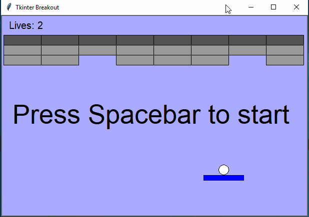

# Breakout clone using tkinter module

## Description

A naive implementation of a breakout-like 'game' (mostly just beginning work done here but it does run
and can be played). It uses the 'Tkinter' module that is shipped with Python installations (originally
written for 2.x back in 2016, but bumped up to only run on 3.x+ more recently).

This project was mainly to familiarize myself with tkinter library and python OOP when learning
Python.



## Installation (Windows 7+)

* Clone this repo, e.g., with git-bash.exe: ```git clone https://github.com/crajun/tkinter-breakout C:\temp\```
* Have running python 3.x+ installation available on %PATH%
* Run: ```python main.py```
* Get frustrated at the terrible laggy controls :rage: